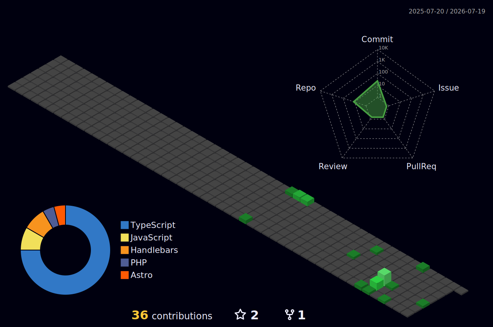

<div align="center">

[](https://carlosjulian.dev)

<a href="https://carlosjulian.dev"></a>
<a href="mailto:ing@carlosjulian.dev"></a>


</div>

<br/>

<!-- Snake Animation -->
<div align="center">
  <picture>
    <source media="(prefers-color-scheme: dark)" srcset="https://raw.githubusercontent.com/carlosjulian/carlosjulian/output/github-snake-dark.svg" />
    <source media="(prefers-color-scheme: light)" srcset="https://raw.githubusercontent.com/carlosjulian/carlosjulian/output/github-snake.svg" />
    
  </picture>
</div>

---

<table>
<tr>
<td width="50%" valign="top">

##  About Me

```js
const carlos = {
  pronouns: "he" | "him",
  location: "Chiapas, México",

  role: "Mechatronics Engineer | IA Engineer | Developer",

  focus: ["AI Engineering", "Software Development", "Automation"],

  currentlyBuilding: ["Practical digital products", "Developer workflows", "Engineering content"],

  currentlyLearning: ["Applied AI", "Systems thinking", "Product engineering"],

  askMeAbout: [
    "Python", "TypeScript", "Next.js",
    "AI workflows", "Automation", "GitHub"
  ],

  links: {
    website: "https://carlosjulian.dev",
    github: "https://github.com/carlosjulian",
    linkedin: "https://www.linkedin.com/in/carlosjulianmx"
  }
};
```

</td>
<td width="50%" valign="top">

##  GitHub Stats


</td>
</tr>
</table>

---

##  Tech Arsenal

<div align="center">

## 🧠 Carlos Julián — AI, Web & 3D Engineering Stack

### Core Languages


### Frontend, UI & 3D Web


### Backend, APIs & Automation


### AI, Agents & Intelligent Systems


### WordPress, SEO & Content Platforms


### DevOps, Cloud & Deployment


### Engineering, Robotics & Education


</div>
---

##  Current Focus

<div align="center">


</div>

- Building practical products with AI, software, and automation.
- Exploring public repositories and shipping experiments on GitHub.
- Growing `Ingtelecto` across social platforms with engineering-focused content.
- Curating featured repositories through my portfolio and GitHub activity.

<div align="center">


</div>

---

##  Analytics & Metrics

<div align="center">


</div>

<details>
<summary><b>📊 More Stats</b></summary>
<br/>

<div align="center">


</div>

</details>

<details>
<summary><b>🏆 GitHub Trophies</b></summary>
<br/>

<div align="center">


</div>

</details>

<details>
<summary><b>📈 3D Contribution Graph</b></summary>
<br/>

<div align="center">
  
</div>

</details>

---

##  My Ventures

<div align="center">

<a href="https://www.instagram.com/carlosjulian_tech/">

</a>
<a href="https://www.youtube.com/@ingtelecto">

</a>
<a href="https://www.tiktok.com/@ingtelectomx">

</a>

</div>

---

##  Connect & Collaborate

<div align="center">

<a href="https://carlosjulian.dev"></a>
<a href="mailto:ing@carlosjulian.dev"></a>

<br/><br/>

<a href="https://github.com/carlosjulian"></a>
<a href="https://www.linkedin.com/in/carlosjulianmx"></a>
<a href="https://x.com/carlosjuliandev"></a>

<br/><br/>

<a href="https://www.instagram.com/carlosjulian_tech/"></a>
<a href="https://www.youtube.com/@ingtelecto"></a>
<a href="https://www.threads.com/@carlosjulian_tech"></a>

</div>

---

<div align="center">

### 💭 Random Dev Quote


</div>

---

<div align="center">


** Thanks for stopping by!**

*"Build with intention, learn in public, and keep shipping."*

</div>


