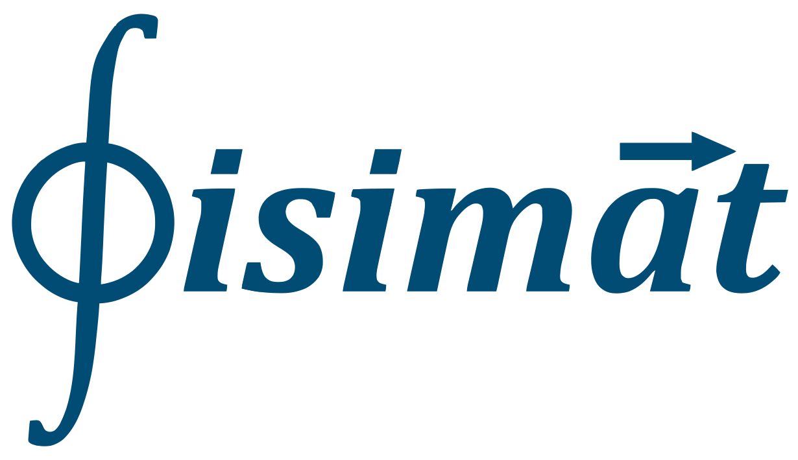
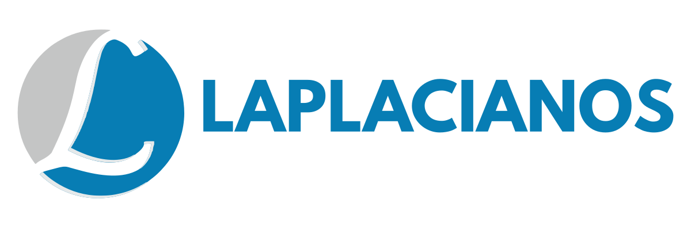

<div align="center">

[](https://carlosjulian.dev)

<a href="https://carlosjulian.dev"></a>
<a href="mailto:ing@carlosjulian.dev"></a>


</div>

<br/>

<!-- Snake Animation -->
<div align="center">
  <picture>
    <source media="(prefers-color-scheme: dark)" srcset="https://raw.githubusercontent.com/carlosjulian/carlosjulian/output/github-snake-dark.svg" />
    <source media="(prefers-color-scheme: light)" srcset="https://raw.githubusercontent.com/carlosjulian/carlosjulian/output/github-snake.svg" />
    
  </picture>
</div>

---

## 👨‍💻 Sobre Mí

```
$ whoami
> Carlos Julián — AI Engineer · Full Stack Developer · Systems Builder
> Chiapas, México · Autodidacta en programación desde 2013

$ cat /focus
> Ingeniería Mecatrónica + Maestría en Ciencias de la Educación
> 12 años docente de física, matemáticas e ingeniería
> Marzo 2026: transición a tiempo completo a Full Stack + IA
> Fundador de Fisimat (2014), Ingtelecto y Laplacianos

$ systemctl status carlos.service
> ● active (running) — Construyendo sistemas y agentes en producción
> Áreas: Sistemas Full Stack · Agentes IA · Infraestructura Linux · STEM
> Inferencia local: Ollama · vLLM · Llama.cpp (GPUs propias)

$ cat /philosophy.md
> "Las matemáticas y la física me dieron el rigor analítico para
> entender los problemas; el software y la inteligencia artificial
> son las herramientas con las que construyo las soluciones."
```

---

## 📊 Estadísticas de GitHub

<div align="center">


</div>

---

## ◈ /TECH ARSENAL

<div align="center">
  <a href="https://skillicons.dev">
    
  </a>
  <br/>
  <a href="https://skillicons.dev">
    
  </a>
</div>

---

## ◈ /ECOSISTEMA

<div align="center">

**Red de plataformas educativas con tráfico orgánico real** · Datos: Google Search Console + GA4 · Año 2025

</div>

<table>
<tr>
<td width="33%" valign="top" align="center">



[](https://www.fisimat.com.mx)

**Desde 2014** · Física y Matemáticas

```yaml
# Métricas 2025 (GSC + GA4)
Usuarios: 762,624
Vistas: 1,812,093
Impresiones: 432,781
Tráfico: Orgánico (1M sesiones)
Videos: 150+ lecciones
```

</td>
<td width="33%" valign="top" align="center">


[](https://ingtelecto.com)

**Desde 2018** · Ingeniería y Robótica

```yaml
# Métricas 2025 (GSC + GA4)
Usuarios: 40,901
Vistas: 79,996
Impresiones: 109,511
Tráfico: Orgánico (41K sesiones)
Microcontroladores: 4 plataformas
```

</td>
<td width="33%" valign="top" align="center">



[](https://laplacianos.com)

**Desde 2020** · Ciencia y Conocimiento

```yaml
# Métricas 2025 (GSC + GA4)
Usuarios: 54,278
Vistas: 85,543
Impresiones: 20,095
Tráfico: Orgánico (61K sesiones)
Artículos: 321+ publicados
```

</td>
</tr>
</table>

<div align="center">

```yaml
ECOSISTEMA TOTAL — AÑO 2025:
  Usuarios activos:    857,803
  Vistas de página:  1,977,632
  Impresiones:       562,387
```

</div>

---

## 📈 Analítica y Métricas

<div align="center">


</div>

---

## 🤝 Conecta y Colabora

<div align="center">

**Web**<br/>
<a href="https://carlosjulian.dev"></a> <a href="mailto:ing@carlosjulian.dev"></a>

**Redes**<br/>
<a href="https://github.com/carlosjulian"></a> <a href="https://www.linkedin.com/in/carlosjulianmx"></a> <a href="https://x.com/carlosjuliandev"></a>

**Contenido**<br/>
<a href="https://www.youtube.com/@ingtelecto"></a> <a href="https://www.instagram.com/carlosjulian_tech/"></a> <a href="https://www.tiktok.com/@ingtelectomx"></a> <a href="https://www.threads.com/@carlosjulian_tech"></a>

</div>

---

<div align="center">


**💜 ¡Gracias por pasar!**

*"Diseñar inteligencia, automatizar sistemas y construir productos que convierten ideas en impacto real."*

</div>


